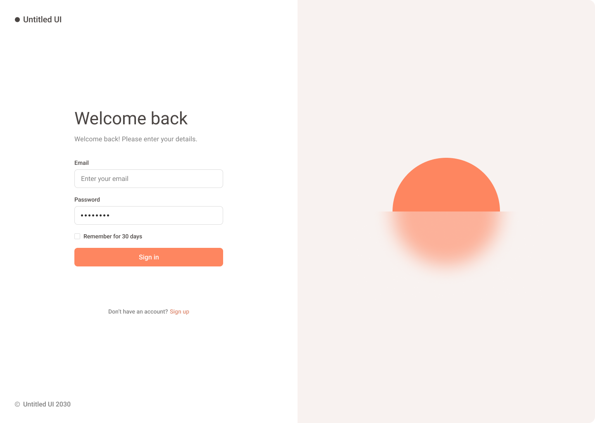
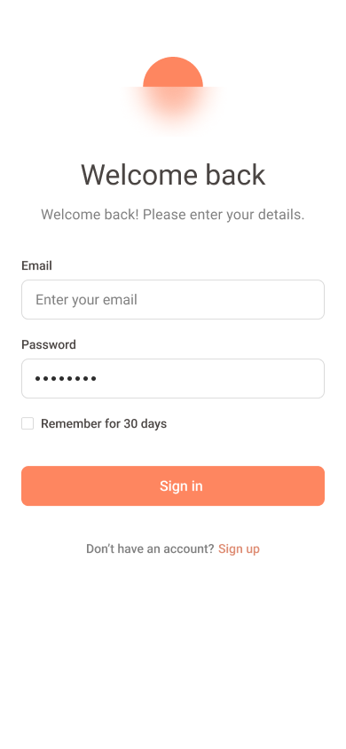

# Task

<table>
  <tr>
    <td style="padding: 0 20px;"></td>
    <td style="padding: 0 20px;"></td>
  </tr>
</table>

## Requirements
Build a responsive login page and welcome screen in [React](https://react.dev/); and integrate the API (documentation is below). The designs can be found in this [Figma](https://www.figma.com/design/0cz9VnEOKG9fCUwGAnbsqM/Login?t=iXBhhKkqChyMq3Pt-1), copy the design to the best of your ability.

The login page should use the provided API endpoints to log the user in. I have sent you the email and password.

The welcome screen should display the secret message from the secret message API endpoint.

Other than React, you are free to use whatever technology you feel will make your job easier.

Finally, host your app using whichever free solution you feel comfortable using and share the GitHub repository.

# Authentication API Documentation

A RESTful API for user authentication. This API provides endpoints for user login, logout, and a single protected route that requires the user to be logged in.

Base URL for all API endpoints: https://login-practice-125p.onrender.com/
For example, to register a new user, send a POST request to: https://login-practice-125p.onrender.com/auth/signup

## API Endpoints

### POST /auth/login
Authenticate a user and receive a session token.

**Request Body:**
```json
{
    "email": "user@example.com",
    "password": "securepassword"
}
```

**Success Response (200):**
```json
{
    "user": {
        "id": "c8460792-bf38-405a-a8c6-aefa545027bb",
        "aud": "authenticated",
        "role": "authenticated",
        "email": "user@example.com",
        "email_confirmed_at": "2024-10-28T02:10:37.573637Z",
        "phone": "",
        "confirmed_at": "2024-10-28T02:10:37.573637Z",
        "last_sign_in_at": "2024-11-24T04:26:03.076729841Z",
        "app_metadata": {
            "provider": "email",
            "providers": [
                "email"
            ]
        },
        "user_metadata": {},
        "identities": [
            {
                "identity_id": "a2450ce0-c342-4b15-89c8-21cbb40438b8",
                "id": "c8460792-bf38-405a-a8c6-aefa545027bb",
                "user_id": "c8460792-bf38-405a-a8c6-aefa545027bb",
                "identity_data": {
                    "email": "user@example.com",
                    "email_verified": false,
                    "phone_verified": false,
                    "sub": "c8460792-bf38-405a-a8c6-aefa545027bb"
                },
                "provider": "email",
                "last_sign_in_at": "2024-10-28T02:10:37.56805Z",
                "created_at": "2024-10-28T02:10:37.568104Z",
                "updated_at": "2024-10-28T02:10:37.568104Z",
                "email": "user@example.com"
            }
        ],
        "created_at": "2024-10-28T02:10:37.562985Z",
        "updated_at": "2024-11-24T04:26:03.081256Z",
        "is_anonymous": false
    }
}
```

**Error Response (401):**
```json
{
    "error": "Invalid login credentials"
}
```

### POST /auth/logout
Log out the current user and invalidate their session.

**Success Response (200):**
```json
{
    "message": "Logged out successfully"
}
```

**Error Response (401):**
```json
{
    "error": "ERROR_MESSAGE"
}
```

### GET /auth/verify-user

Verify if the current user is logged in.

**Success Response (200):**
```json
{
    "message": "You are logged in",
    "user": {
        "id": "c8460792-bf38-405a-a8c6-aefa545027bb",
        "aud": "authenticated",
        "role": "authenticated",
        "email": "user@example.com",
        "email_confirmed_at": "2024-10-28T02:10:37.573637Z",
        "phone": "",
        "confirmed_at": "2024-10-28T02:10:37.573637Z",
        "last_sign_in_at": "2024-11-24T04:32:03.897481Z",
        "app_metadata": {
            "provider": "email",
            "providers": [
                "email"
            ]
        },
        "user_metadata": {},
        "identities": [
            {
                "identity_id": "a2450ce0-c342-4b15-89c8-21cbb40438b8",
                "id": "c8460792-bf38-405a-a8c6-aefa545027bb",
                "user_id": "c8460792-bf38-405a-a8c6-aefa545027bb",
                "identity_data": {
                    "email": "tester1@test.com",
                    "email_verified": false,
                    "phone_verified": false,
                    "sub": "c8460792-bf38-405a-a8c6-aefa545027bb"
                },
                "provider": "email",
                "last_sign_in_at": "2024-10-28T02:10:37.56805Z",
                "created_at": "2024-10-28T02:10:37.568104Z",
                "updated_at": "2024-10-28T02:10:37.568104Z",
                "email": "user@example.com"
            }
        ],
        "created_at": "2024-10-28T02:10:37.562985Z",
        "updated_at": "2024-11-24T04:32:03.900175Z",
        "is_anonymous": false
    }
}
```

**Error Response (401):**
```json
{
    "error": "Please log in."
}
```

### GET /api/secret-message
Example protected route that requires user to be logged in.

**Success Response (200):**
```json
{
    "id": 1,
    "created_at": "2024-11-25T00:31:40.662521+00:00",
    "secret_message": "SECRET_MESSAGE"
}
```
